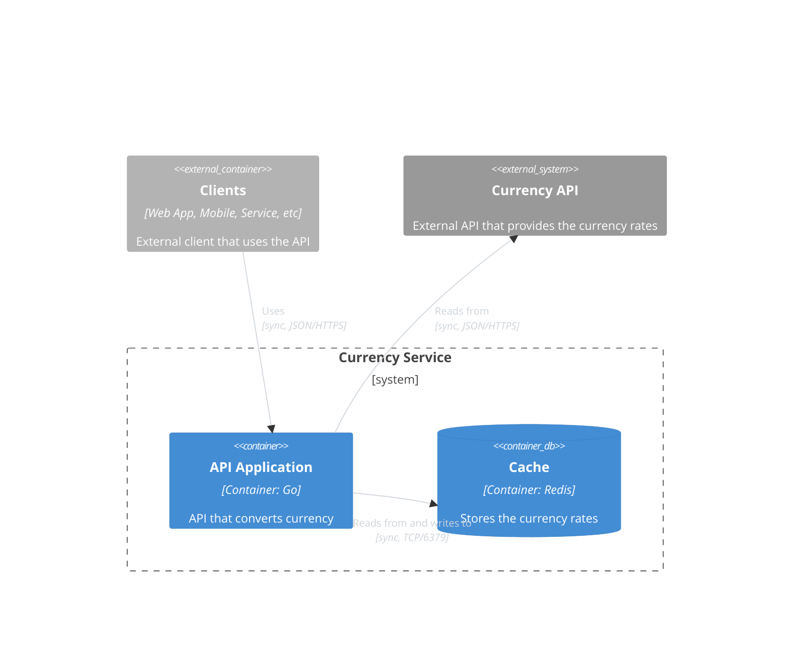
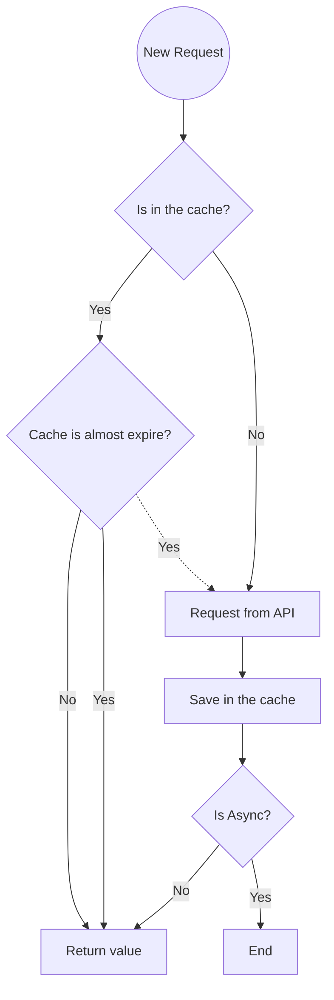

# Currency Service


[](https://github.com/edmarfelipe/currency-service/actions/workflows/build.yml)
[](https://codecov.io/gh/edmarfelipe/currency-service)

## Description

This is a simple service that converts currency using the [Currency API](https://currencyapi.com/).

## Table of Contents
- [Overview](#overview)
  * [Architecture](#architecture) 
  * [Caching strategy](#caching-strategy)
- [Installing](#installing)
- [Usage](#usage)
- [REST API](#rest-api)
- [Architecture](#architecture)
- [Caching strategy](#caching-strategy)

### Overview

#### Architecture



#### Caching strategy

We want to always get from the cache as match as possible, to do so, we will update the cache in the background, while we return the value from the cache.


### Installing

To work with this project, you need to have installed:
* [Go 1.20](https://golang.org/doc/install)
* [Docker](https://docs.docker.com/get-docker/)
* [Docker Compose](https://docs.docker.com/compose/install/)
* [Make](https://www.gnu.org/software/make/)

### Usage

#### Running the project

```shell
docker-compose up -d
```

#### Building the project

```shell
make build
```

#### Running the tests

```shell
make test
```

### REST API

[Open API Definition](./swagger.yaml)

| Description   | Verb   | Path                            |
|---------------|--------|---------------------------------|
| Convert Value | GET    | /api/convert/{currency}/{value} |
| Metrics       | GET    | /api/metrics                    |
| Ready         | GET    | /api/ready                      |

Example of request:

```shell
curl --request GET \
  --url http://localhost:3000/api/convert/BRL/543.34
```

### Project Key Features

- Structure Logging with Request ID
- Graceful Shutdown
- Healthcheck route that waits for the startup to finish
- Usage of Redis [Client-side Caching](https://redis.io/topics/client-side-caching)
- Prometheus metrics with latency and request count
- Tiny docker image with distroless base image


